# Práctica 6.2 - Despliegue de una aplicación PHP con Nginx y MySQL usando Docker y Docker-Compose
Para comenzar, la ip usada fue 192.168.91.192.

## Estructura de directorios

Para comenzar, se ha creado una estructura de directorios como la siguiente:

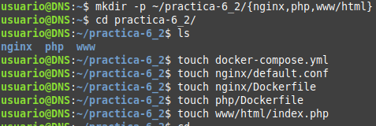

que queda de la siguiente forma:

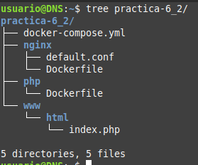

## Creación del contenedor de Nginx

Para comenzar, modificamos el docker-compose.yml:

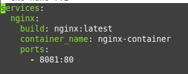

Correremos el contenedor y comprobaremos que funciona correctamente:

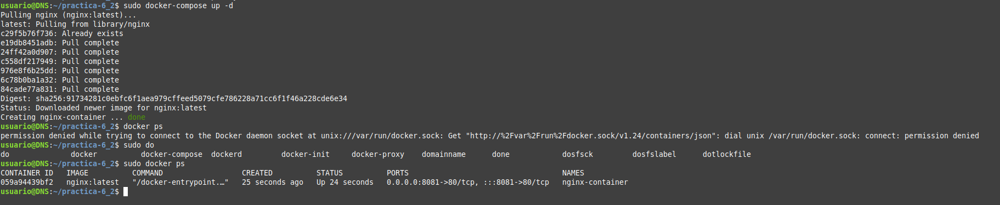

Si funciona correctamente, veremos la siguiente página:

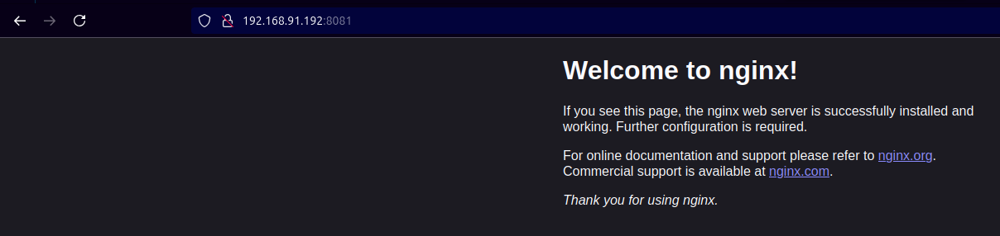

## Creación del contenedor de PHP

Creamos el index.php:

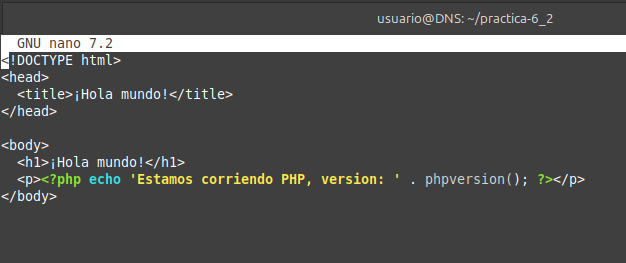

Ahora debemos de modificar la configuración de Nginx para que pueda ejecutar PHP:

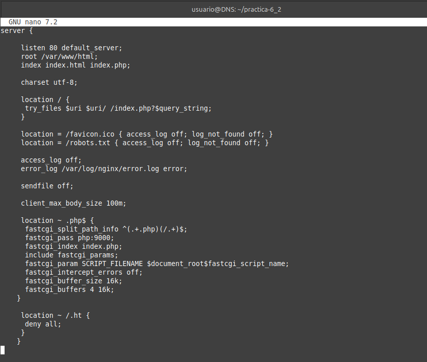

y por último modificamos el Dockerfile de Nginx:

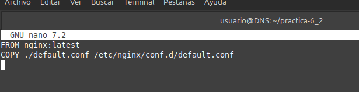

Modificamos el docker-compose.yml:

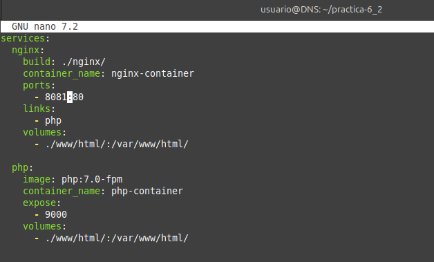

Ahora levantamos los contenedores y comprobamos que funciona correctamente:

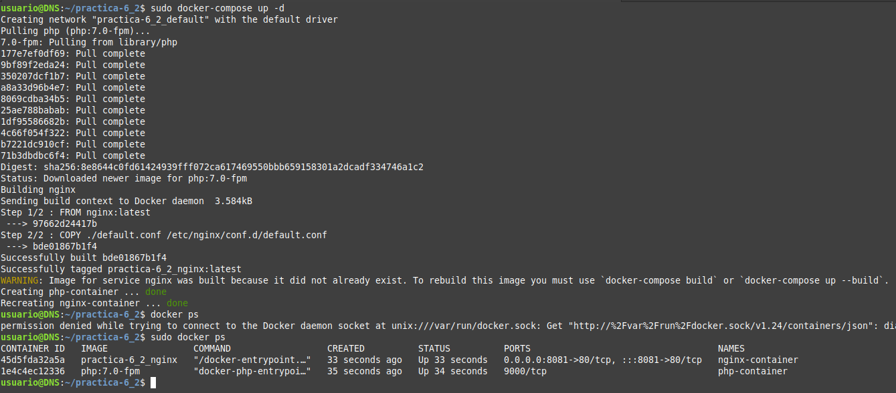

Comprobamos que funciona correctamente:

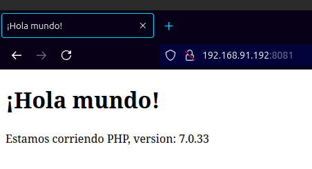

## Creación del contenedor MySQL

Modificamos el Dockerfile de php:

Modificamos el docker-compose.yml:

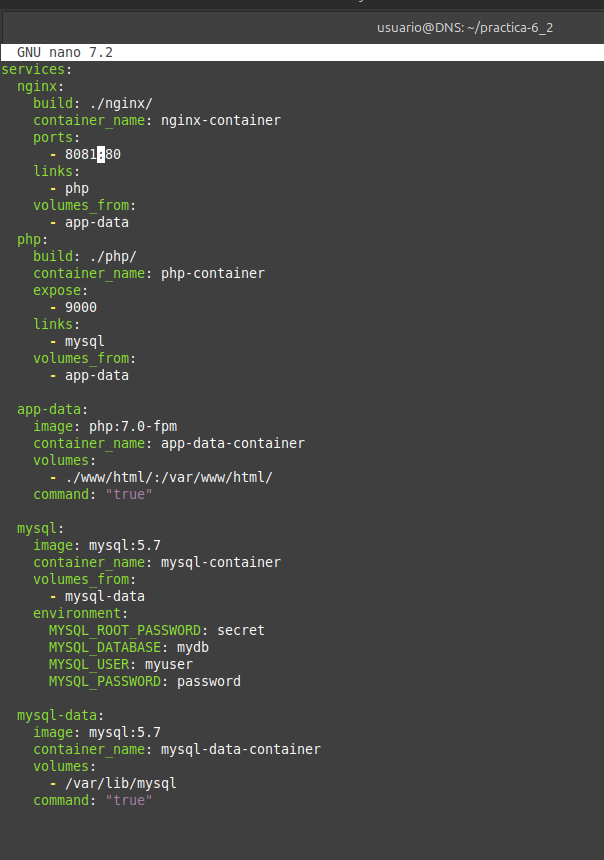

Modificamos el index.php:

Se levantan los contenedores y comprobamos que funciona correctamente:

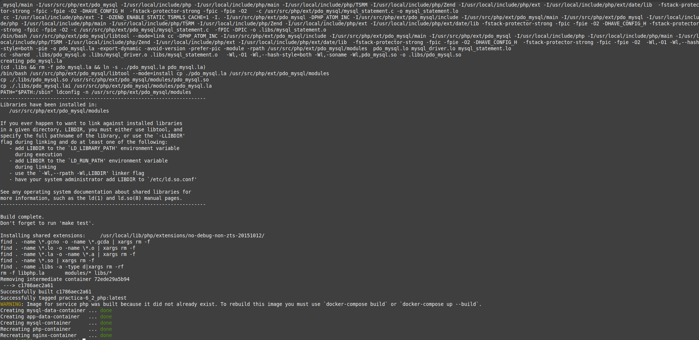

y comprobamos los contenedores:

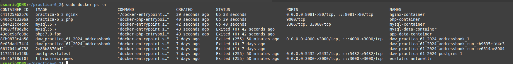

## Conexión a la base de datos

Accedemos a la página y comprobamos que funciona correctamente:

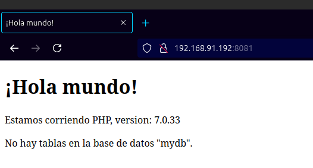

Ahora para comprobar que se ha conectado correctamente a la base de datos, modificamos el index.php con un nuevo usuario, dejando el index así:

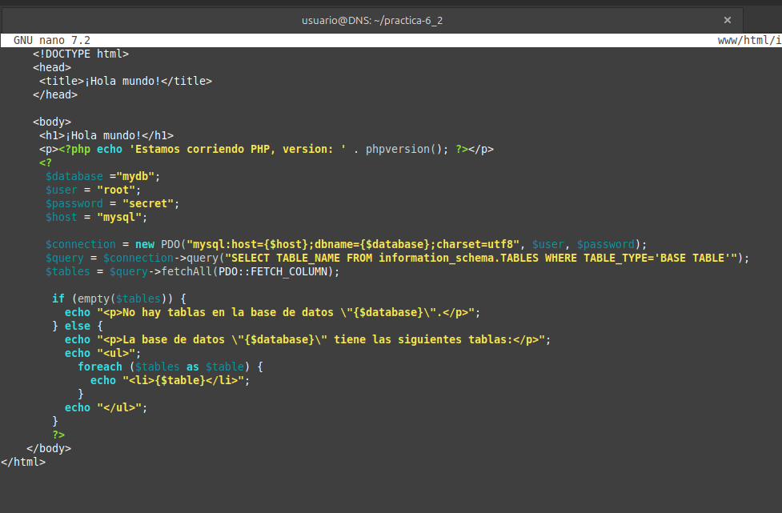

y comprobamos que funciona correctamente:

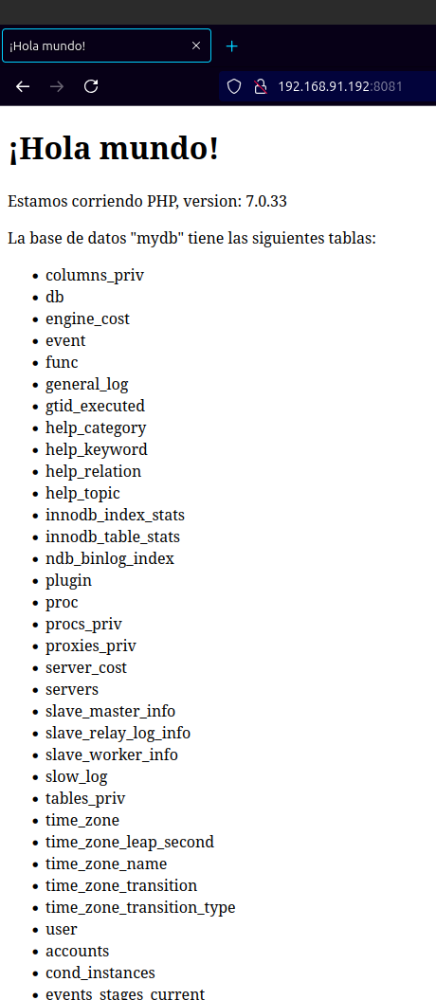

## Esquema de la aplicación

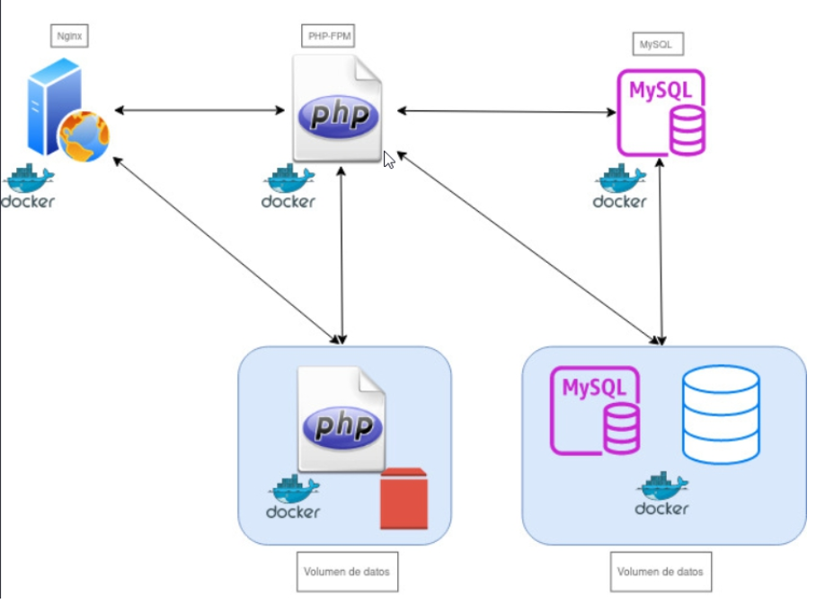
